# 使用Kettle-时间戳增量回滚同步

## 0. 前言

本文介绍了使用`Kettle`对一张业务表数据（500万条数据以上）进行实时（10秒）同步，采用了时间戳增量回滚同步的方法。关于ETL和Kettle的入门知识大家可以阅读相关的blog和文档学习。
<!-- more -->

## 1. 时间戳增量回滚同步

假定在源数据表中有一个字段会记录数据的新增或修改时间，可以通过它对数据在时间维度上进行排序。通过中间表记录每次更新的时间戳，在下一个同步周期时，通过这个时间戳同步该时间戳以后的增量数据。

**但是时间戳增量同步不能对源数据库中历史数据的删除操作进行同步**，并且使用时间戳实时增量同步是不能完全避免这个问题的。我们仅仅可以通过在每次同步时，把时间戳回滚一定的时间段，从而同步一定时间段内的删除操作。
这就是时间戳增量回滚同步，这个名字是我自己给取得，就是在时间戳增量同步的同时回滚一定的时间段。

**说明**：

- **源数据表** 需要被同步的数据表
- **目标数据表** 同步至的数据表
- **中间表** 存储时间戳的表

## 2. 前期准备

在两个数据库中分别创建数据表，并通过脚本在源数据表中插入500万条数据，完成后再以每秒一条的速度插入新数据，模拟生产环境。

源数据表结构如下：

```sql
CREATE TABLE `im_message` (
  `id` int(11) NOT NULL AUTO_INCREMENT,
  `sender` varchar(45) COLLATE utf8_bin NOT NULL COMMENT '消息发送者：SYSTEM',
  `send_time` datetime(6) NOT NULL,
  `receiver` varchar(45) COLLATE utf8_bin NOT NULL COMMENT '消息接受者',
  `content` varchar(255) COLLATE utf8_bin NOT NULL COMMENT '消息内容',
  `is_read` tinyint(4) NOT NULL COMMENT '消息时候被读取：0-未读；非0-已读',
  `read_time` datetime DEFAULT NULL,
  PRIMARY KEY (`id`),
  UNIQUE KEY `id_UNIQUE` (`id`)
) ENGINE=InnoDB AUTO_INCREMENT=1 DEFAULT CHARSET=utf8 COLLATE=utf8_bin COMMENT='消息表'

```

## 3. 作业流程

1. 开始组件
2. 建时间戳中间表
3. 获取中间表的时间戳，并设置为全局变量
4. 删除目标表中时间戳及时间戳以后的数据
5. 抽取两个数据表的时间戳及时间戳以后的数据进行比对，并根据比对结果进行删除、新增或修改操作
6. 更新时间戳

## 4. 创建作业

作业的最终截图如下：

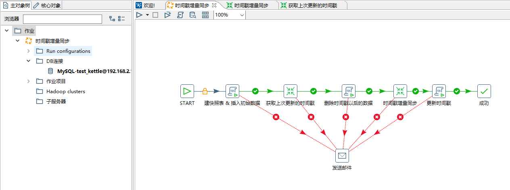

### 4.1 创建作业和DB连接

打开Spoon工具，新建作业，然后在左侧主对象树DB连接中新建DB连接。连接创建并测试通过后可以在左侧DB连接下右键共享出来。因为在单个作业或者转换中新建的DB连接都是都是局域数据源，在其他转换和作业中是不能使用的，即使属于同一个作业下的不同转换，所以需要把他们共享，这样DB连接就会成为全局数据源，不用多次编辑。

### 4.2 建时间戳中间表

这一步是为了在目标数据库中新建中间表`etl_temp`,并插入初始的时间戳字段。因为该作业在生产环境是循环调用的，该步骤在每一个同步周期中都会调用，所以在建表时需要判断该表是否已经存在，如果不存在才建表。

SQL代码和组件配置截图如下：

```sql
CREATE TABLE IF NOT EXISTS etl_temp(id int primary key,time_stamp timestamp);
INSERT IGNORE INTO etl_temp (id,time_stamp) VALUES (1,'2018-05-22 00:00:00');
```

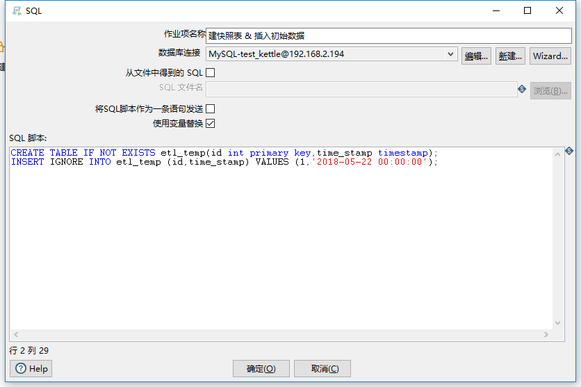

> 我把该作业时间戳的ID设为1，在接下来的步骤中也是通过这个ID查询我们想要的时间戳

### 4.2 获取时间戳并设为变量

新建一个转换，在转换中使用表输入和设置变量两个组件

#### 表输入

`SQL`代码和组件配置截图如下

在`Kettle`中设置的变量都是字符串类型，为了便于比较。我在SQL语句把查出的时间戳进行了格式转换

```sql
select date_format(time_stamp , '%Y-%m-%d %H:%i:%s') time_stamp from etl_temp where id='1'
```

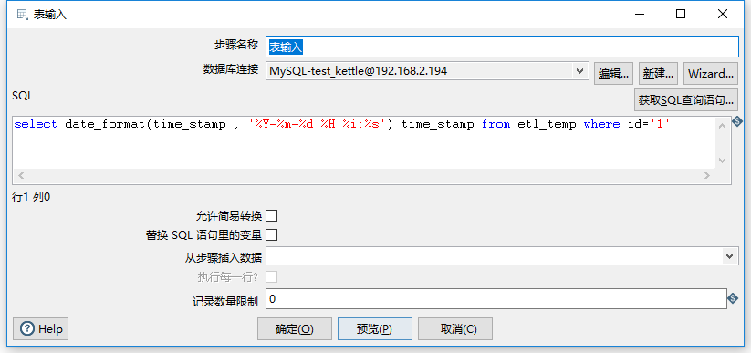

#### 设置变量

变量活动类型可以为该变量设置四种有效活动范围，分别是JVM、该Job、父Job和祖父Job

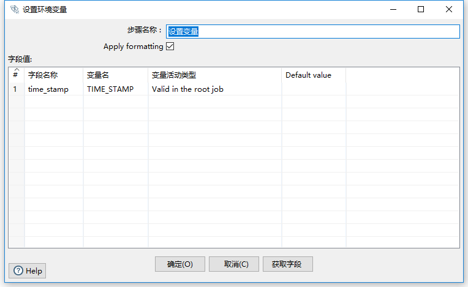

### 4.3 删除目标表中时间戳及时间戳以后的数据

这样做有两个好处：

1. **避免在同步中重复或者遗漏数据**。比如说上一次同步最后一个数据的时间戳是`2018-05-25 18:12:12`,这样本次同步周期结束后中间表中的时间戳就会是`2018-05-25 18:12:12`。如果在本次同步完成后 在源数据表中 仍然有时间戳为`2018-05-25 18:12:12`的新数据参数，那么在下一次同步周期时，就会出现BUG。采用大于时间戳的方式同步就会遗漏数据，采用等于时间戳的方式同步就会重复同步数据。
2. **增加健壮性** 当作业异常结束后，不用做任何多余的操作就可以重启。因为会删除目标表中时间戳及时间戳以后的数据，所以不用担心数据一致性问题

在组件中使用了上一步骤设置的变量，所以必须勾选使用变量替换

```sql
delete from test_kettle.im_message where send_time>='${TIME_STAMP}'
```

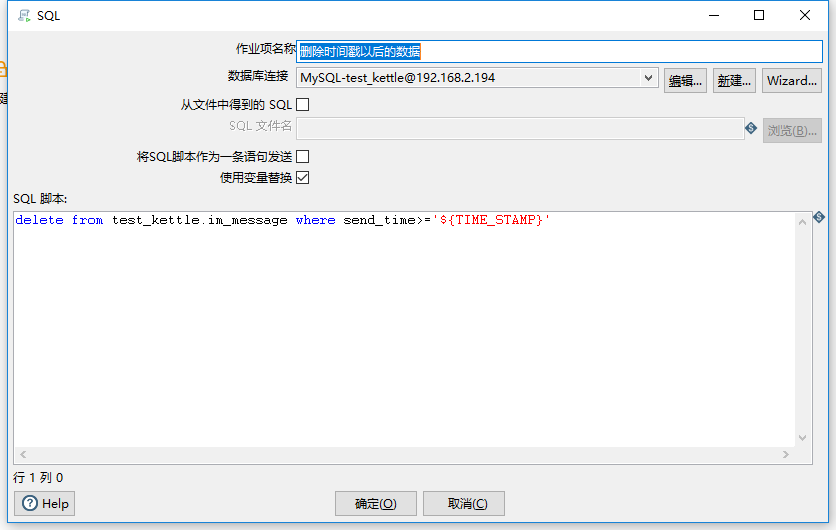

### 4.4 抽取、比对和更新数据

这一步才是真正的数据同步步骤，完成了数据的抽取、比对，并根据不同的比对结果删除、更新、插入或不做任何操作。
正如前文所说，为了同步删除操作，在原始表输入和目标表输入步骤中回滚了一定时间段。其中回滚的时间段设置为了全局的参数。左右空白处右键即可设置参数，该作业下的所有作业和转换都能使用，设置如下图

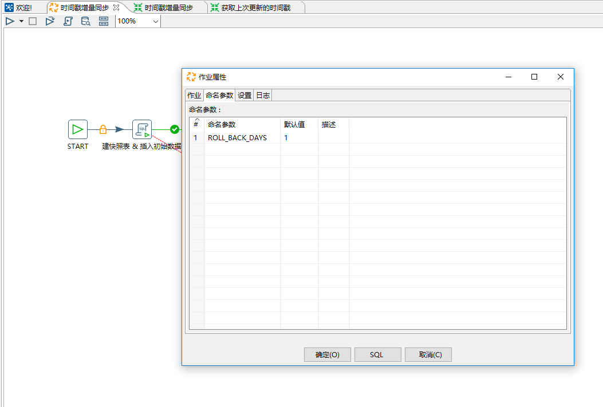

转换截图如下

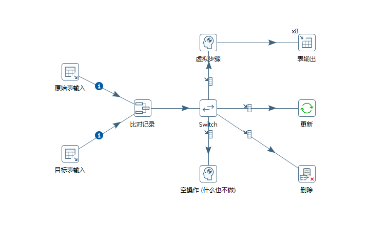

#### 原始表输入

```sql
SELECT
  id
, sender
, send_time
, receiver
, content
, is_read
, read_time
FROM ueqcsd.im_message
where send_time>= date_sub(str_to_date('${TIME_STAMP}','%Y-%m-%d %H:%i:%s'), interval ${ROLL_BACK_DAYS} day);
```

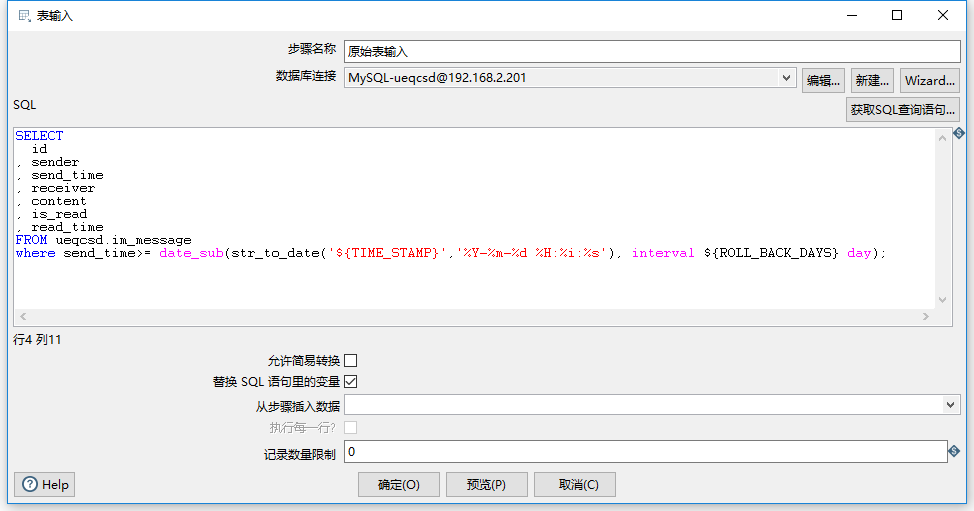

#### 目标表输入

```sql
SELECT
  id
, sender
, send_time
, receiver
, content
, is_read
, read_time
FROM test_kettle.im_message
where send_time>= date_sub(str_to_date('${TIME_STAMP}','%Y-%m-%d %H:%i:%s'), interval ${ROLL_BACK_DAYS} day);
```

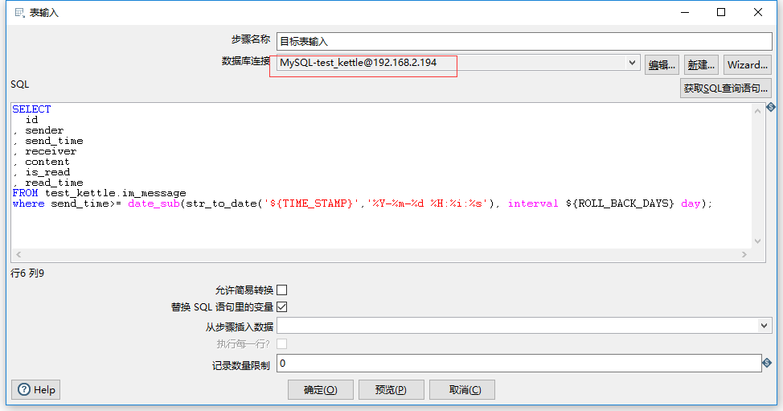

> 注意两个组件的数据库链接是不同的，当然它们也就这个和名字不同

#### 比对记录

对两个表输入查出的数据进行比对，并把比对的结果写进输入流，传递给后面的组件。
比对的结果有三种：

- new
- changed
- deleted

标注字段表示比对结果的字段名，后面有用。关键字段表示比对的字段，在这个作业中我们比较两个的主键`ID`。

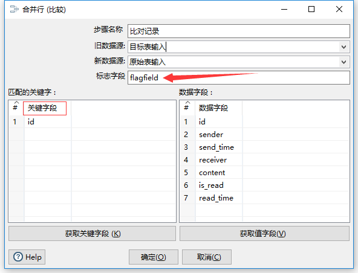

#### Switch

该步骤对上一步骤产生的标注字段进行路由，不同的结果路由到不同的步骤。其中目标步骤表示下一步骤的名字。

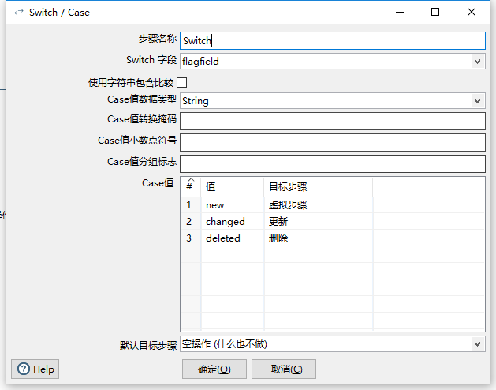

#### 插入

`Kettle`有一个插入/更新组件，但是据网友介绍这个组件性能低下，每秒最多只能同步几百条数据，所有我对插入和更新分别作了不同的处理。插入使用表输出组件；更新使用更新组件。
为了进一步提升同步效率，我在表输出组件使用了多线程（右键>改变开始复制的数量），使同步速度达到每秒12000条。Switch组件和表输出组件中间的虚拟组件（空操作）也是为了使用多线程添加的。

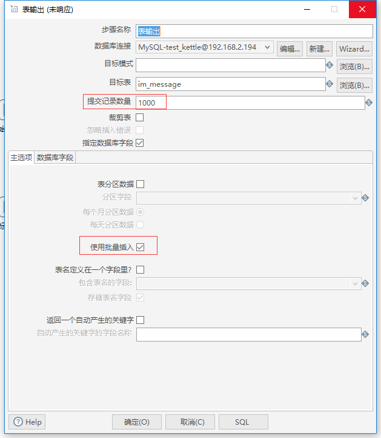
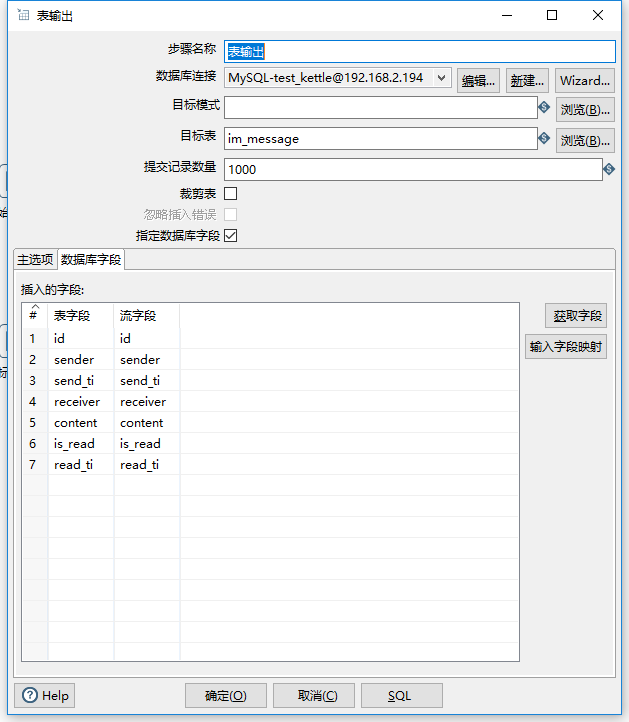

> 勾选批量插入，可以极大提高同步速度

#### 更新和删除

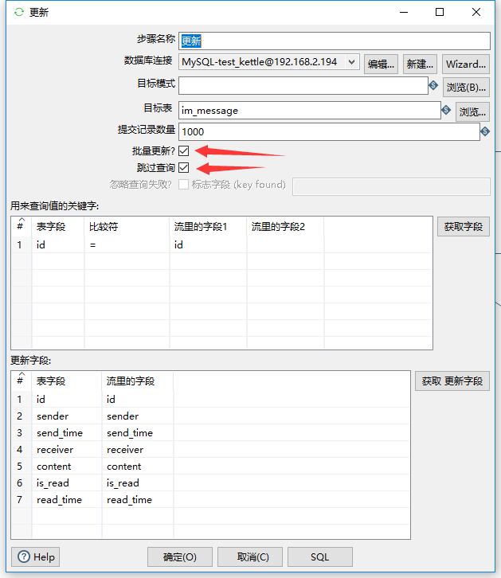

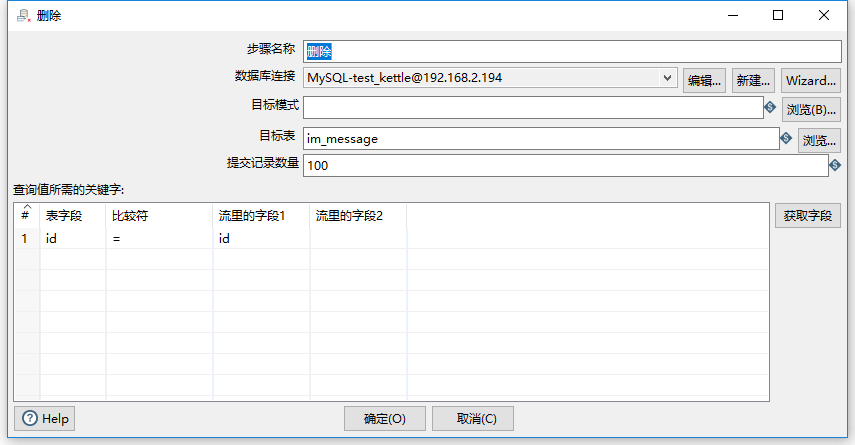

### 4.5 更新时间戳

```sql
set @new_etl_start_time_stamp = (SELECT SEND_TIME FROM test_kettle.im_message ORDER BY SEND_TIME DESC LIMIT 1);
update etl_temp set time_stamp=@new_etl_start_time_stamp where id='1';
```

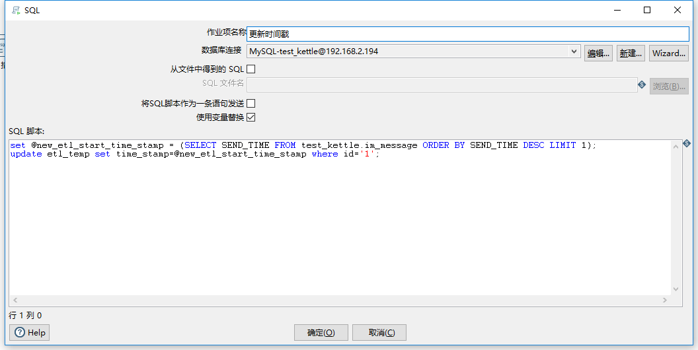

### 4.6 发送邮箱

关于发送邮件组件网上有很多资料，就不多做介绍。特别强调一点，邮箱密码是 单独的授权码，而不是邮箱登录密码。

## 运行

在开发环境点击Spoon界面左上角三角符号运行作业即可。

在第一次运行时，为了提高同步效率，可以先不创建目标表的索引。在第一此同步完成后，再创建索引。然后在START组件中编辑调度逻辑，再次启动。

如下图所示

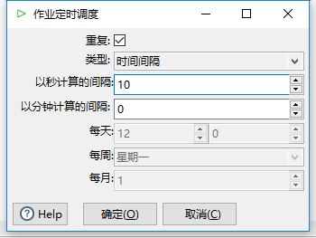

运行日志如下图

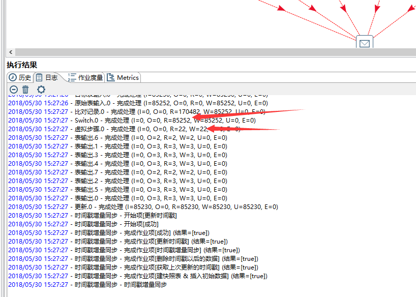

这样，一个使用时间戳增量回滚同步数据的作业就完成了，如果对这个job有什么建议，可以给我发邮件 `zhaodongxx@outlook.com` 。

## 参考资料

- [Kettle中ETL的效率优化 简书](https://www.jianshu.com/p/66cefe5208a7)
- [Kettle手册（九）- 发送邮件](https://ask.hellobi.com/blog/yuguiyang1990/7289)